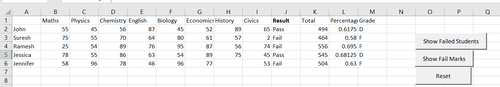
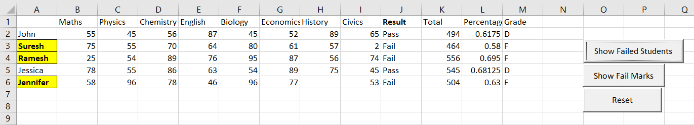
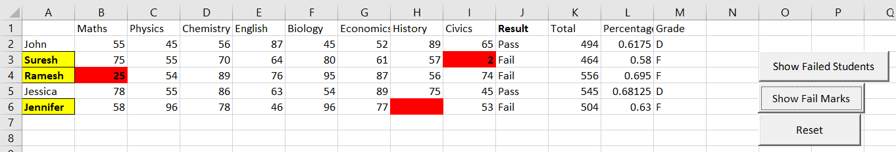

iniial plans
Students record with all subject marks
Create a macro to calcualte the 
1. percentage and Grade
2. Print the output in a xlsx flickering

create a button to highlight fail subjects with red color
calcualte the grades based on condition of pass / fail

we will write a set of functions in module and then we can call it outside while calulating the grade.
export button will trigger a macro which creates a new excel file and then gives student name , grade and percentage

Extend by opening the csv and copying the data to this xlsm file then do the mentioned process. 

Implemented solutions:
added **functions**
1.  To calculate pass/ fail
2.  To calcualte total score
3.  To caluclate grade letters

**Buttons** to do the below 
1. To show / highlight students who have failed.
   
2. To highlight the marks of subjects they have failed.
    

3. To reset all the folrmating done from the above buttons.
 

